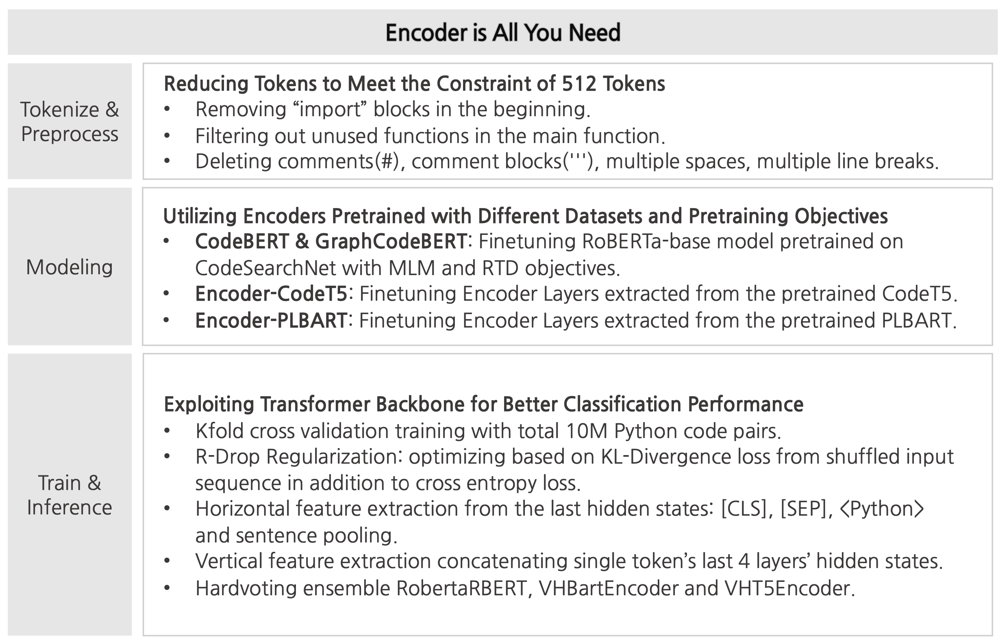
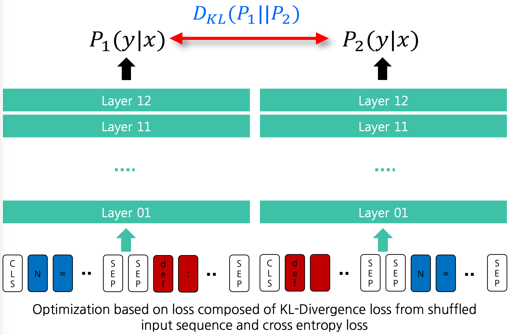
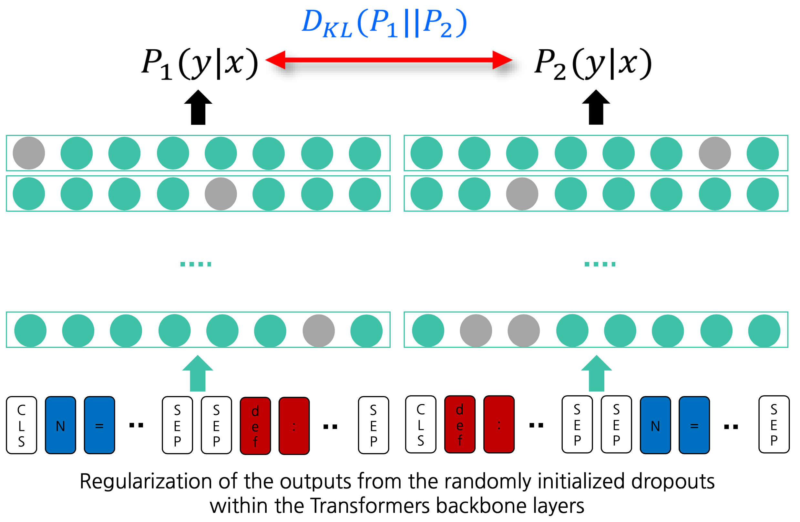
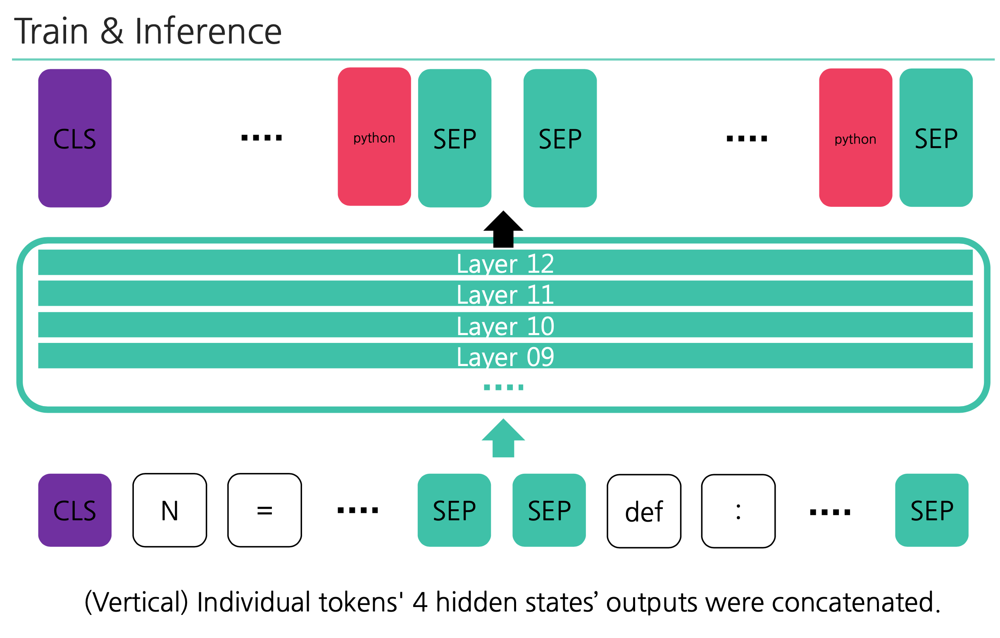
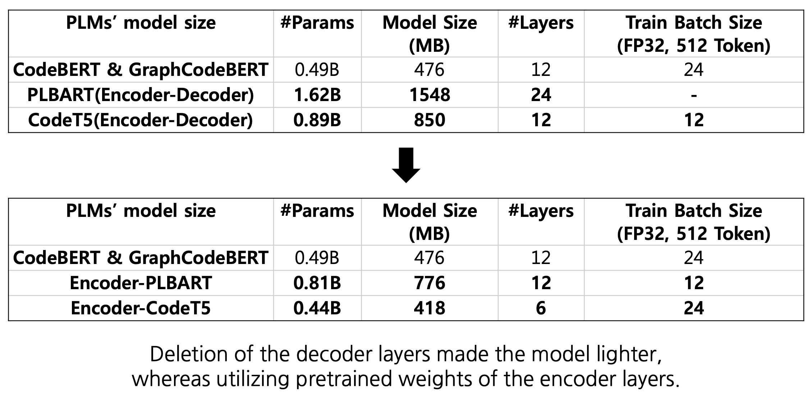

# Python Clone Detection

**[📄 Please refer to README.pdf for detailed explanation](./README.pdf)**

## ImprovedRDrop for Clone Detection

## Vertical-Horizontal Feature Extraction

## EncoderBART and EncoderT5

### References

- [BERT: Pre-training of Deep Bidirectional Transformers for Language Understanding](https://arxiv.org/pdf/1810.04805.pdf)
- [R-Drop: Regularized Dropout for Neural Networks](https://arxiv.org/pdf/2106.14448.pdf)
- [EncT5: Fine-tuning T5 Encoder for Non-autoregressive Tasks](https://arxiv.org/pdf/2110.08426.pdf)
- [An Improved Baseline for Sentence-level Relation Extraction](https://arxiv.org/pdf/2102.01373.pdf)
- [Enriching Pre-trained Language Model with Entity Information for Relation Classification](https://arxiv.org/pdf/1905.08284.pdf)
- [Unified Pre-training for Program Understanding and Generation](https://arxiv.org/pdf/2103.06333.pdf)
- [CodeXGLUE: A Machine Learning Benchmark Dataset for Code Understanding and Generation](https://arxiv.org/pdf/2102.04664.pdf)
- [CodeT5: Identifier-aware Unified Pre-trained Encoder-Decoder Models for Code Understanding and Generation](https://arxiv.org/pdf/2109.00859.pdf)
- [CodeBERT: A Pre-Trained Model for Programming and Natural Languages](https://arxiv.org/pdf/2002.08155.pdf)
- [GRAPHCODEBERT: PRE-TRAINING CODE REPRESENTATIONS WITH DATA FLOW](https://openreview.net/pdf?id=jLoC4ez43PZ)